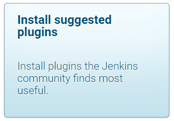
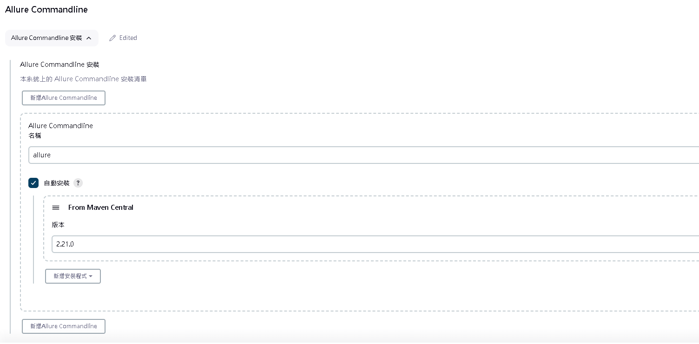
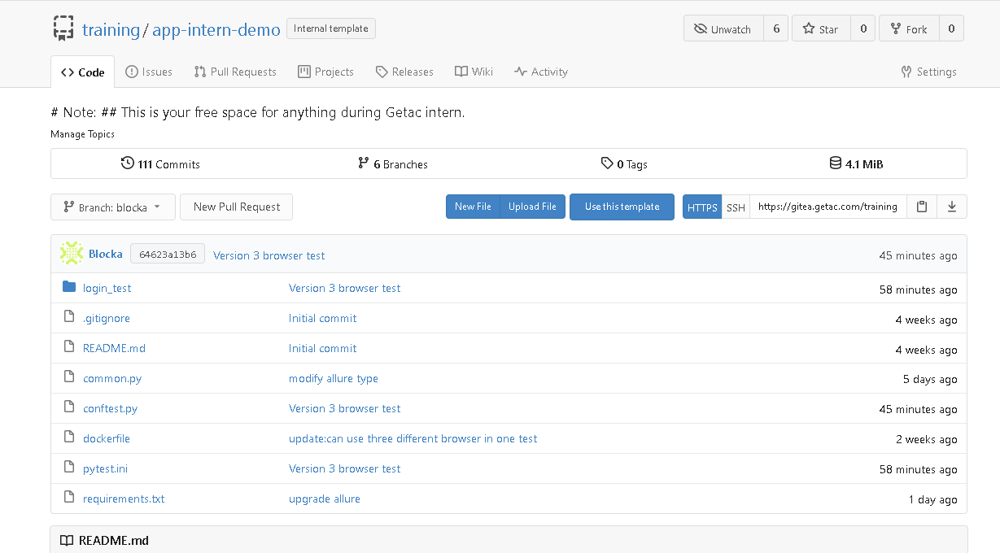
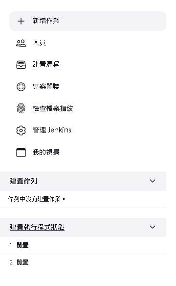
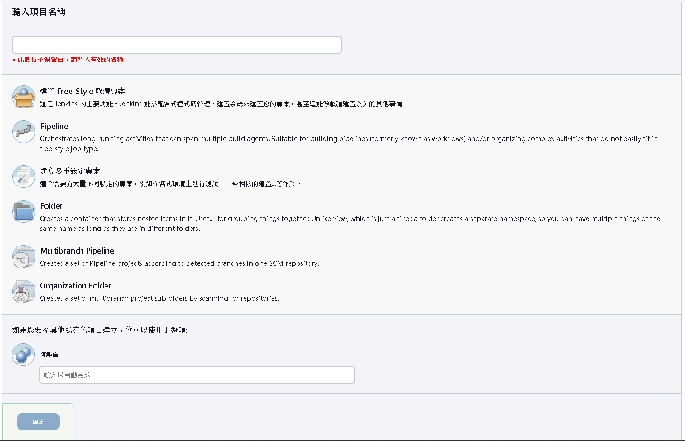
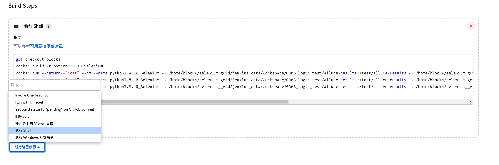
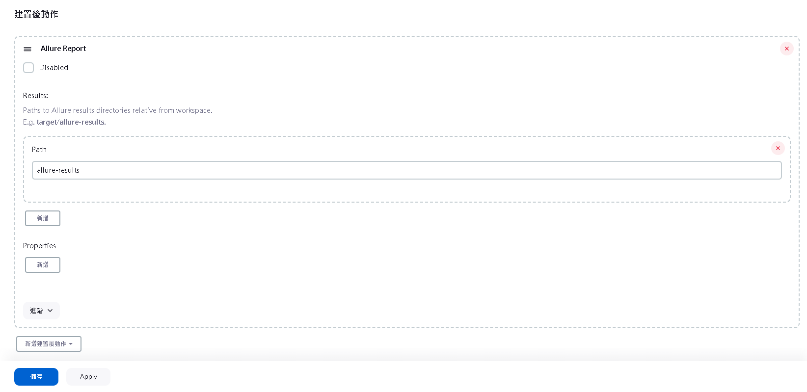
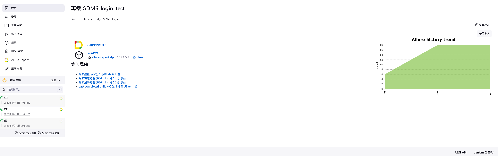
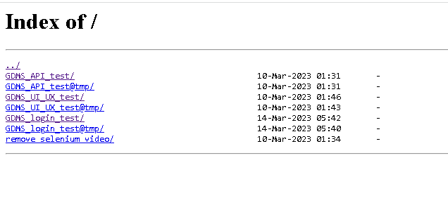

Executing Selenium tests with pytest using Python.

## Contents
* [Structure setup](#structure-setup)
  + [Start Jenkin、Selenium dynamic grid、nginx(for allure) with docker compose](#start-jenkin-selenium-dynamic-grid-nginx-for-allure-with-docker-compose)
  + [Download Allure Plugin](#download-allure-plugin)
  + [Install the docker client if you want to execute the Docker command in Docker Jenkins](#install-the-docker-client-if-you-want-to-execute-the-docker-command-in-docker-jenkins)
  + [Unit test source code](#unit-test-source-code)
  + [How to use Jenkins to run test case](#how-to-use-jenkins-to-run-test-case)
    - [For Freestyle](#for-freestyle)
  + [Allow others to view the Allure report](#allow-others-to-view-the-allure-report)
## Structure setup
### Start Jenkin、Selenium dynamic grid、nginx(for allure) with docker compose
Running docker-compose in the background

    docker compose -f docker-compose-v3-dynamic-grid.yml up -d

Stops containers and removes containers, networks, volumes

    docker compose -f docker-compose-v3-dynamic-grid.yml down

check http://localhost:8080/ if Jenkins is started   
check http://localhost:4444/ if Selenium Grid is started

View jenkins password

    cat /var/jenkins_home/secrets/initialAdminPassword

click install suggested plugins



### Download Allure Plugin

From your Jenkins dashboard navigate to `"管理 Jenkins"` -> `"管理外掛程式"` and select the Available tab. Locate this plugin by searching for `allure-jenkins-plugin`.Select the option `"Download now and Install after the restart"` button. In which plugin is installed after the restart.

next step,click `"全域工具設定"` and set the `Allure Commandline` in Jenkins as shown below.



### Install the docker client if you want to execute the Docker command in Docker Jenkins

execute the bash command in the docker Jenkins container

    docker exec -it jenkins-lts-jdk11 /bin/bash

Install the docker client package

    apt-get update && apt-get -y install apt-transport-https ca-certificates curl gnupg2 software-properties-common && curl -fsSL https://download.docker.com/linux/$(. /etc/os-release; echo "$ID")/gpg > /tmp/dkey; apt-key add /tmp/dkey && add-apt-repository "deb [arch=amd64] https://download.docker.com/linux/$(. /etc/os-release; echo "$ID") $(lsb_release -cs) stable" && apt-get update && apt-get -y install docker-ce

exit jenkins bash

    exit


## Unit test source code

I put the test source code and dockerfile on gitea.



## How to use Jenkins to run test case

Two methods, Freestyle project(easy to use) or Pipeline.

### For Freestyle

click `"新增作業"`



Enter the project name, select the Freestyle project and click `"確定"`



click `"git"` and paste github repo.If you do not want to keep previous data, check `"Delete workspace before build starts"`.

Scroll down to find the `"Build Steps"` section, click on `"新增建置步驟"`, then select `"執行 Shell"`. In the shell, enter the command. An example is shown below.

``` bash
 df -h
```



click `"新增建置後動作"`, click `"Allure Report"` and save.



Click `"馬上建置"`, and after the execution is complete, you can click on `"Allure Report"` to view the report.




## Allow others to view the Allure report

Enter the command `"hostname -I"` in the Ubuntu command line,and You can see it by entering the address of the first IPv4 in the browser.



After that, click on the project name and then click on 'allure-report/' to complete the process.

